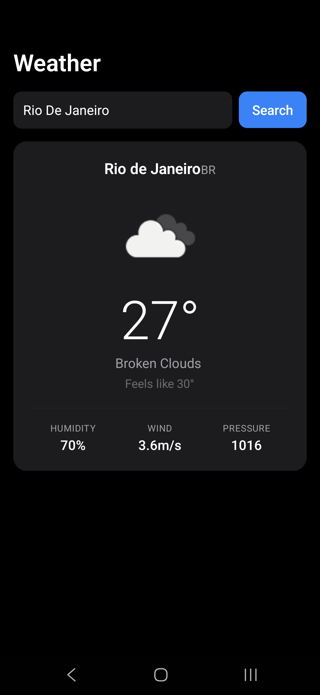

This is a simple weather app made using [**React Native**](https://reactnative.dev) project, bootstrapped using [`@react-native-community/cli`](https://github.com/react-native-community/cli). It fetches data from OpenWeatherMap.

# Getting Started

> **Note**: Make sure you have completed the [Set Up Your Environment](https://reactnative.dev/docs/set-up-your-environment) guide before proceeding and a valid API Key for [OpenWeatherMap](https://openweathermap.org/api)

## Step 1: Start Metro

First, you will need to run **Metro**, the JavaScript build tool for React Native.

To start the Metro dev server, run the following command from the root of your React Native project:

```sh
# Using npm
npm start

# OR using Yarn
yarn start
```

## Step 2: Build and run your app

With Metro running, open a new terminal window/pane from the root of your React Native project, and use one of the following commands to build and run your Android or iOS app:

### Android

```sh
# Using npm
npm run android

# OR using Yarn
yarn android
```

### App


# Troubleshooting

If you're having issues getting the above steps to work, see the [Troubleshooting](https://reactnative.dev/docs/troubleshooting) page.

# Learn More

To learn more about React Native, take a look at the following resources:

- [High-Performance Caching in React Native with MMKV (Using TypeScript)](https://medium.com/@buseapaydin8/high-performance-caching-in-react-native-with-mmkv-using-typescript-eb9fb8521d86)
- [React Native Website](https://reactnative.dev) - learn more about React Native.
- [Getting Started](https://reactnative.dev/docs/environment-setup) - an **overview** of React Native and how setup your environment.
- [Learn the Basics](https://reactnative.dev/docs/getting-started) - a **guided tour** of the React Native **basics**.
- [Blog](https://reactnative.dev/blog) - read the latest official React Native **Blog** posts.
- [`@facebook/react-native`](https://github.com/facebook/react-native) - the Open Source; GitHub **repository** for React Native.


<a href="https://www.flaticon.com/free-icons/weather-app" title="weather app icons">Weather app icons created by Edi Prast - Flaticon</a>